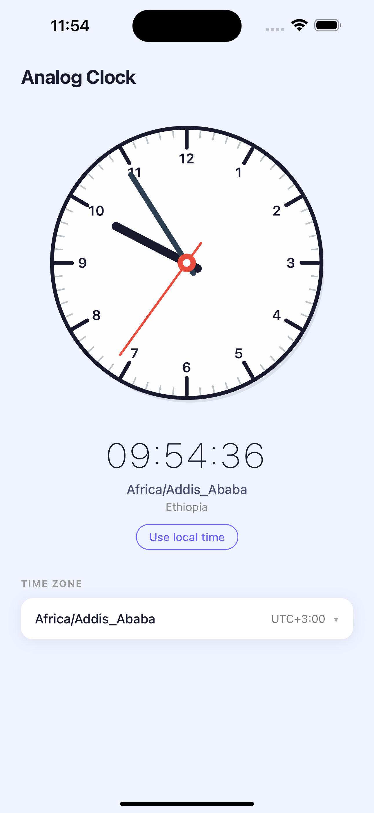

# Analog Clock App

A React Native mobile application displaying a fully custom analog clock
with multi-timezone support and offline-first SQLite persistence.

## Preview

<p align="center">
   
</p>

---

## Architecture Decisions

### Component Breakdown

| Layer | Responsibility |
|---|---|
| `App.tsx` | Provider setup (Redux, SafeArea) |
| `screens/HomeScreen` | Composes all features; drives data loading |
| `components/AnalogClock` | Pure SVG clock — accepts `ClockTime`, renders hands |
| `components/TimeZoneSelector` | Modal picker with live search |
| `store/slices/timezoneSlice` | RTK slice + async thunks for load/select |
| `services/api/timezoneApi` | HTTP fetch from TimezoneDB API |
| `services/database/sqliteService` | All SQLite reads/writes (singleton connection) |
| `hooks/useClock` | Ticks every second; converts UTC+offset → ClockTime |
| `hooks/useOrientation` | Dimension listener → portrait/landscape |

### State Management — Redux Toolkit

Redux Toolkit was chosen because:
- `createAsyncThunk` makes the three-state (pending/fulfilled/rejected)
  lifecycle of async operations explicit and boilerplate-free.
- RTK's `immer`-powered reducers allow direct mutation syntax in reducers,
  reducing cognitive overhead.
- The store is the single source of truth for timezones and selected zone,
  making the component tree trivially reactive.

### Clock Rendering — react-native-svg

The clock is drawn with `react-native-svg` primitives (`Circle`, `Line`, `G`).
A fixed 200×200 SVG viewBox scales to any screen size — the component only
changes the `width`/`height` props on the `<Svg>` element, so no math is
repeated inside the SVG coordinate system.

Hand rotation is applied via `<G rotation={angle} origin="100,100">` — clean,
GPU-composited, and no trigonometry needed for positioning the line endpoints.

---

## Offline Caching Approach

**Strategy: Stale-While-Revalidate**

1. On cold start, SQLite is queried immediately — if a cache exists, the UI
   shows timezones within milliseconds even with no network.
2. The API is always contacted in parallel. On success the cache is automically
   updated (single SQLite transaction) and the Redux store is refreshed.
3. If the API fails the app continues with cached data and shows an
   "Offline mode" indicator to the user.
4. The user's selected timezone is stored in a separate `user_preferences`
   key-value table and restored on every launch.

**Cache expiry:** Rows carry a `cachedAt` timestamp. After 24 hours the data
is considered stale — it is still served immediately but the background
refresh is treated as mandatory rather than optional.

**Corruption recovery:** All DB operations are wrapped in try/catch.
If SQLite cannot be opened at all, `db` remains `null` and every service
function throws early, letting the app fall back to API-only mode.
A "Reset cache" button in the error banner calls `clearAllCachedData()`
followed by a fresh `initializeTimezones()` dispatch.

---

## Assumptions & Trade-offs

| Decision | Rationale |
|---|---|
| No `AsyncStorage` | The spec mandates SQLite; op-sqlite covers all use cases |
| `@op-engineering/op-sqlite` | Best New Architecture (with RN 0.85) support; JSI-based, no bridge overhead |
| `react-native-svg` | Not a clock library — just SVG primitives; keeps the "no prebuilt clock" constraint |
| Single-screen app | Scope doesn't warrant navigation; HomeScreen is the only screen |
| Pull-to-refresh | Gives the user manual control over API refresh without a dedicated button |
| `getItemLayout` on FlatList | Timezone list can be 400+ rows; fixed height enables O(1) scroll-to-index |
| No debounce on search | Native JS filter on 400 items is imperceptible; debounce would add latency |
| Selected timezone validated on restore | Prevents showing a stale/removed zone after an API update |

---

## Setup

```bash
# 1. Clone & install
npm install

# 2. iOS
cd ios && bundle exec pod install && cd ..
npx react-native run-ios

# 3. Android
npx react-native run-android
```

**Note** The `TIMEZONEDB_API_KEY` in
`src/constants/index.ts` is not replaced, so the app can be easily build & evaluated
